# Deploying the 111-PEM-Adaptor test site to Azure/AWS

## Contents
1. [Azure](#Azure)
2. [AWS](#AWS)

## Azure
### Pre-requisites
- An Azure account (https://azure.microsoft.com/en-gb/)

### Deployment Steps (via portal)
1. To get started with deploying to Azure, the first thing you will need is an Azure account already set up. Navigate to the Azure Portal and click on “Storage Accounts”.
2. Click on “Create” which can be found in the top left and go ahead and fill in the details (create your resource group and storage account name).
    - For the “Redundancy” option, change to “Locally redundant storage” (LRS). Then go ahead and click “Review + Create”. 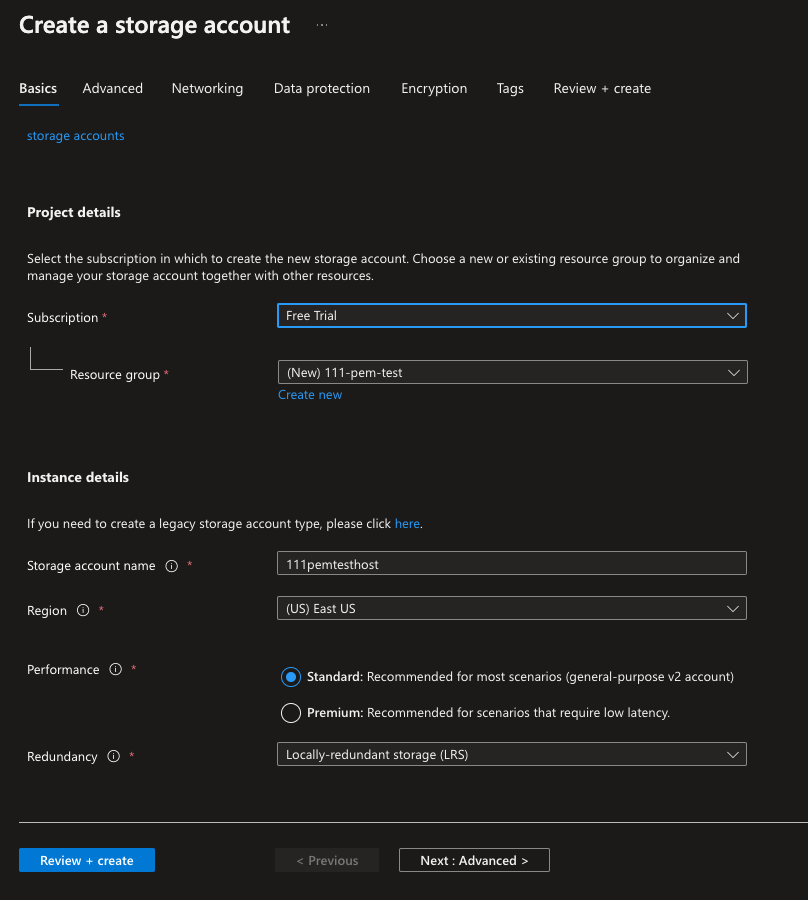
3. Once your storage account has been created, go ahead and click into it. On the left of the screen will be a column, select “Static website” under the Data management section. 
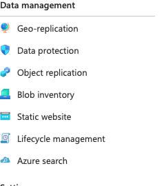
    - Here we want to change “Static website” to Enabled, and in the “Index document name” and “Error document path”, simply enter Index.html. 
    - Once done, click on Save and this should now generate your primary endpoint.
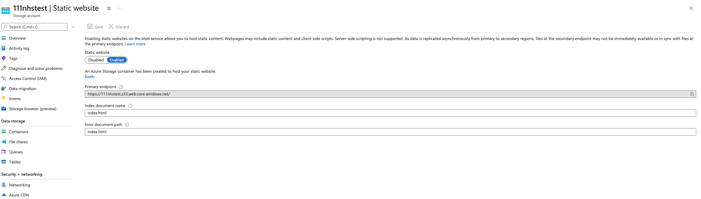

4. Now that we’re set up on Azure, navigate to your storage account.
Under the Data storage section on the left, click Containers. 

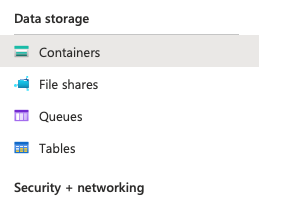

You should see a container named $web, click into this and here is where we are going to paste the contents of our build folder.
5. Find the “build folder” within your react project, copy all contents within that folder and drag them into the Azure container. (Alternatively, use the ‘Upload’ button in the top left and then browse your local machine for the files.) 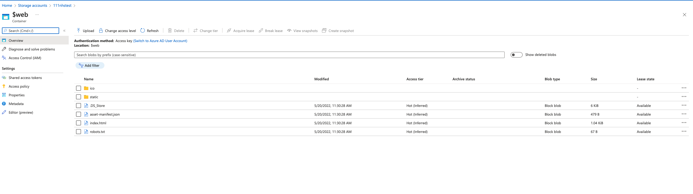
6. Once uploaded, you should now be able to access your application via your primary endpoint through your browser (copy and paste the url into a browser of your choice).

## AWS
### Pre-requisites
- Create a free AWS account (via https://aws.amazon.com/resources/create-account/)

### Deployment Steps (via AWS Console)
1. To get started with deploying to AWS, the first thing you will need is an AWS account already set up. Navigate to the AWS Console Home and in the search bar type in “S3” and click on it.

2. Once you have been redirected to the S3 console, on the right of the page click on “Create bucket”. This is where we will be deploying our application.
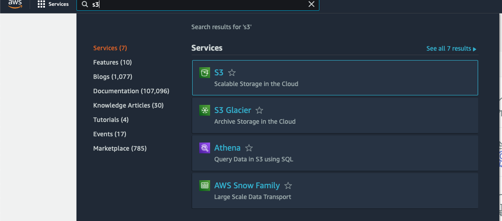
    - You will now see a form, fill this in with the relevant information. Name your bucket (of your choice) and set the region to one closest to you (in this case EU (London) eu-west-2).
    - Untick “Block all public access” and tick the box confirming and acknowledging this choice.
    - Click on Create Bucket at the bottom of the form.

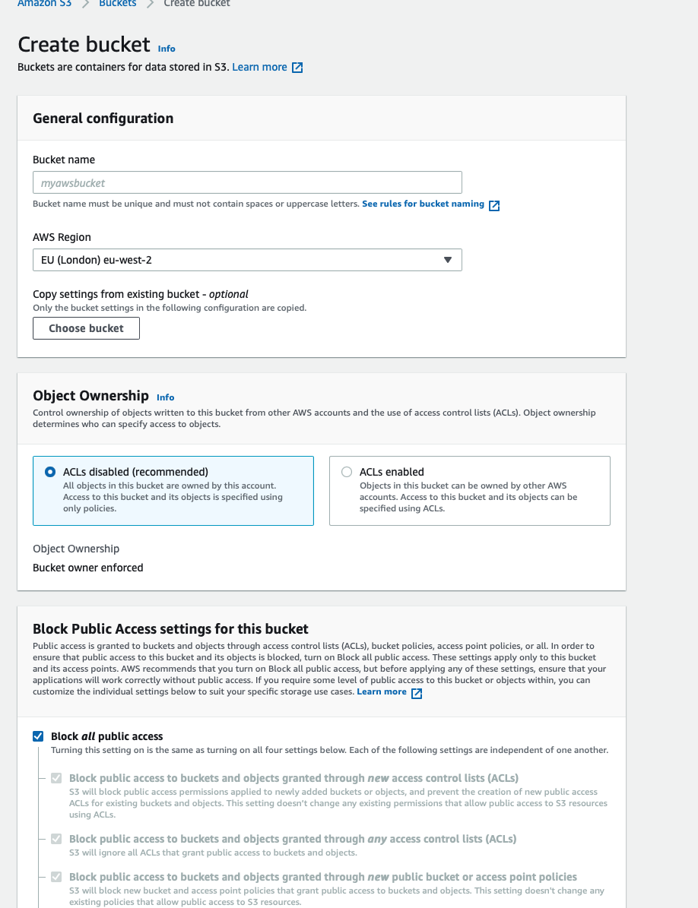

3. Next, click into your bucket and navigate to the ‘Permissions’ tab. Find “Bucket Policy” and click the edit button next to it.
    - Replace the JSON data already there with the following: 
            { 
               "Version": "2012-10-17",  
                &nbsp; "Statement": [  
                    &nbsp;&nbsp; {  
                        &nbsp;&nbsp;&nbsp; "Sid": "Stmt1380877761162",  
                        &nbsp;&nbsp;&nbsp; "Effect": "Allow",  
                        &nbsp;&nbsp;&nbsp; "Principal": {  
                        &nbsp;&nbsp;&nbsp;     "AWS": "*"  
                        &nbsp;&nbsp;&nbsp; },  
                        &nbsp;&nbsp;&nbsp; "Action": "s3:GetObject",  
                        &nbsp;&nbsp;&nbsp; "Resource": "arn:aws:s3::://YourBucketName//*"  
                    &nbsp;&nbsp; }  
                &nbsp; ]  
            }  
    - Replace //YourBucketName// with your bucket name, and then click Save changes.
    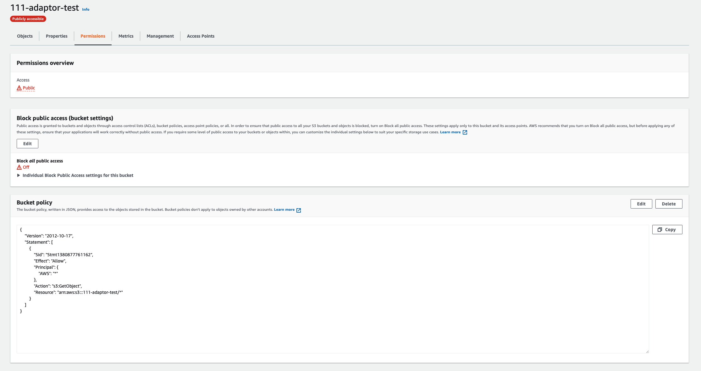

4. Go back into the bucket, and next click on the ‘Properties’ tab, scroll down to ‘Static website hosting’ and click edit. 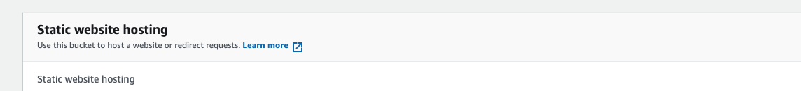
    - Enable static website hosting.
    - Under Index document and Error document, enter Index.html
    - Click Save changes. This will now generate our primary endpoint. 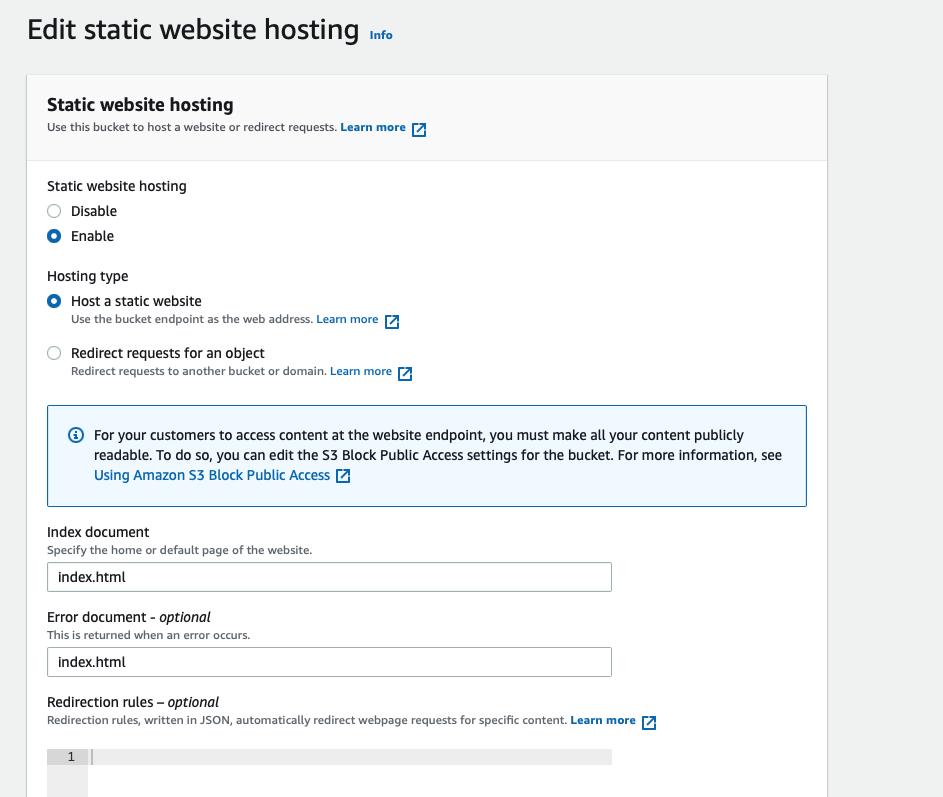

5. Lastly, back into our bucket and navigate to the ‘Objects’ tab.
    - Here we will paste the contents of our applications Build folder.
    - This can either be done by dragging and dropping the contents of the folder into the browser, or
    - Click on Upload and browse your local machine for the files and upload them.
    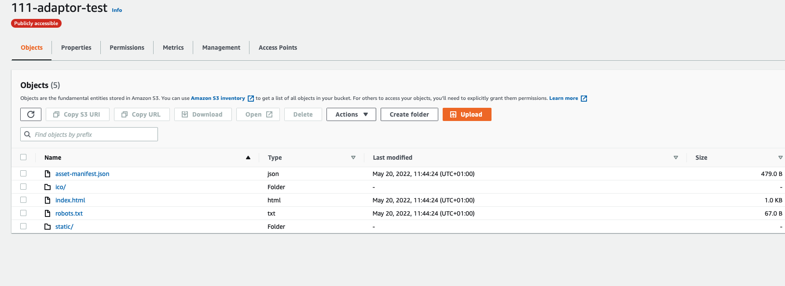

6. Once complete, if you paste your primary endpoint into the url bar in your browser you should now see your application running through AWS.

